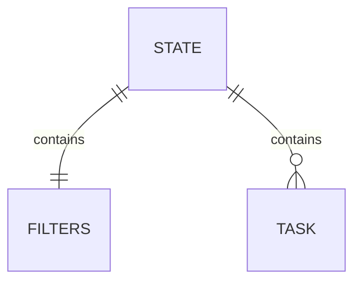

# ✅ Digital-Resume (Sheila Kobue)

This digital resume designed to focus on simplicity and user-friendliness offering a streamlined approach to showcase my professional credentials. Embracing a minimalist philosophy. It prioritizes only the essential features, resulting in a clean and efficient presentation. It provides a straightforward and easily navigable profile. While offering a bare bones experience, this intentional simplicity enhances usability, ensuring that employers can swiftly access the necessary information, such as work experience, skills, education, and contact details. 

<!-- omit in toc -->
## Table of Contents

- [✅ Digital-Resume (Sheila Kobue)](#-digital-resume-sheila-kobue)
  - [Features](#features)
  - [Requirements](#requirements)
  - [Data](#data)
  - [Getting Started](#getting-started)
  - [User Stories](#user-stories)

## Features

- 💚 Simple and user-friendly
- 🐜 Focus on minimal functionality
- 💪 Ability to add, edit and complete tasks

## Requirements

- An IDE like [Visual Studio Code](https://code.visualstudio.com).
- Basic [HTML, CSS](https://developer.mozilla.org/en-US/docs/Learn) skills.
- A browser like [Chrome](https://www.google.com/chrome).

## Data



## Getting Started

1. Clone the repository

```
git clone https://github.com/Sheilakobue/SHEKOB881_bcl2302_Naeem_SheilaKobue_ITW9-main.git
```

2. Run a localhost server

3. Open `index.html`.

## User Stories

- 👤 As a user, I want my resume to have a Header/hero   section with the following
    your full name 
    your career title 
    an introductory statement
    a link to your contact section
    A link to your GitHub account

- 👤 As a user, I want my page to have
    education section listing every educational institution you attended 
    and/or all certifications and qualifications you have earned.

- 👤 As a user, I want my page to have a skills section 
- 👤 As a user, I want my page must have a footer that contains a contact section with external links to my GitHub account, my LinkedIn account, and any other social links I want to add
  
- 👤 As a user, I want my contact section to also include a contact form and formSubmit service for people who view my website may get into contact with me. Also include my email address in case people do not want to get in contact with me immediately, or if they want to share my email address with someone else.
  
- 👤 As a user, I want pages/sections such as work-experience, a projects section to showcase what I have worked on, a navigation bar.
 

